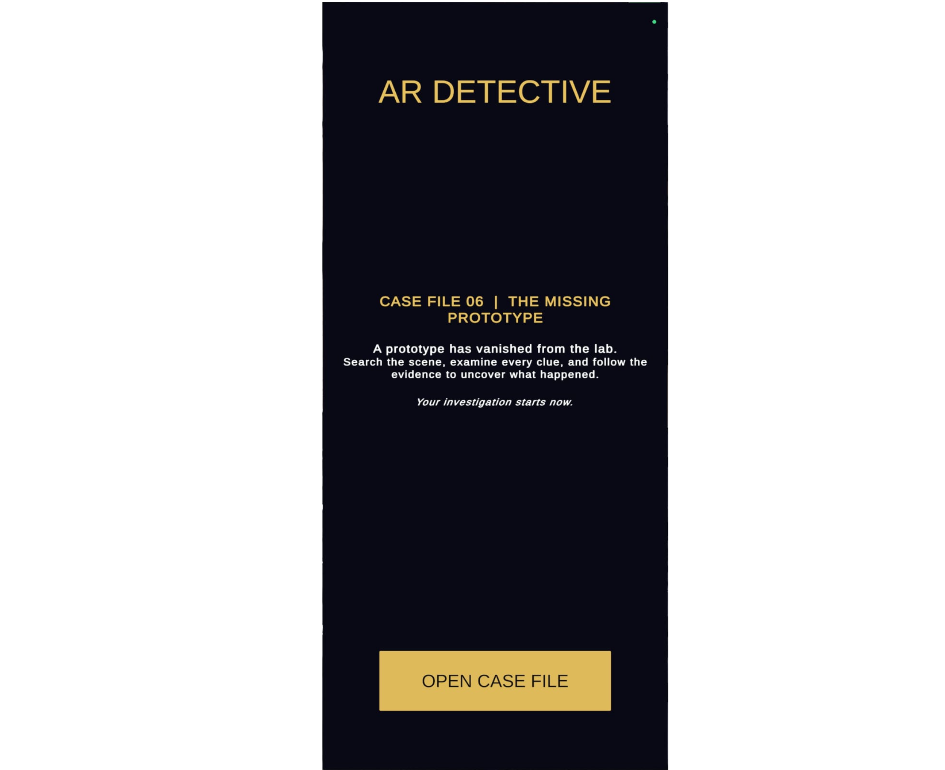
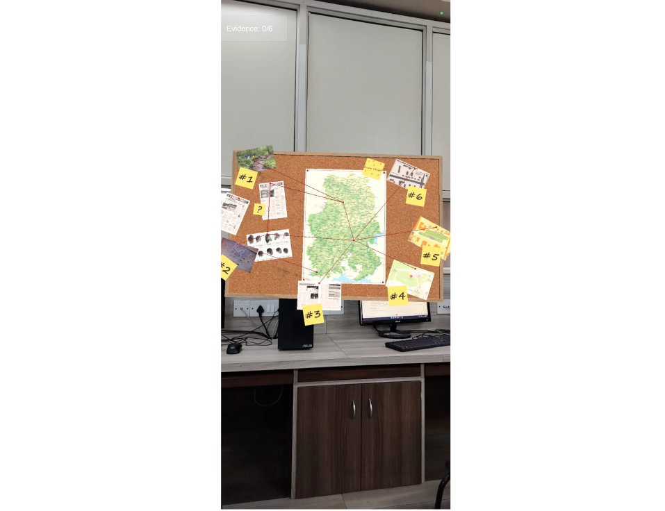
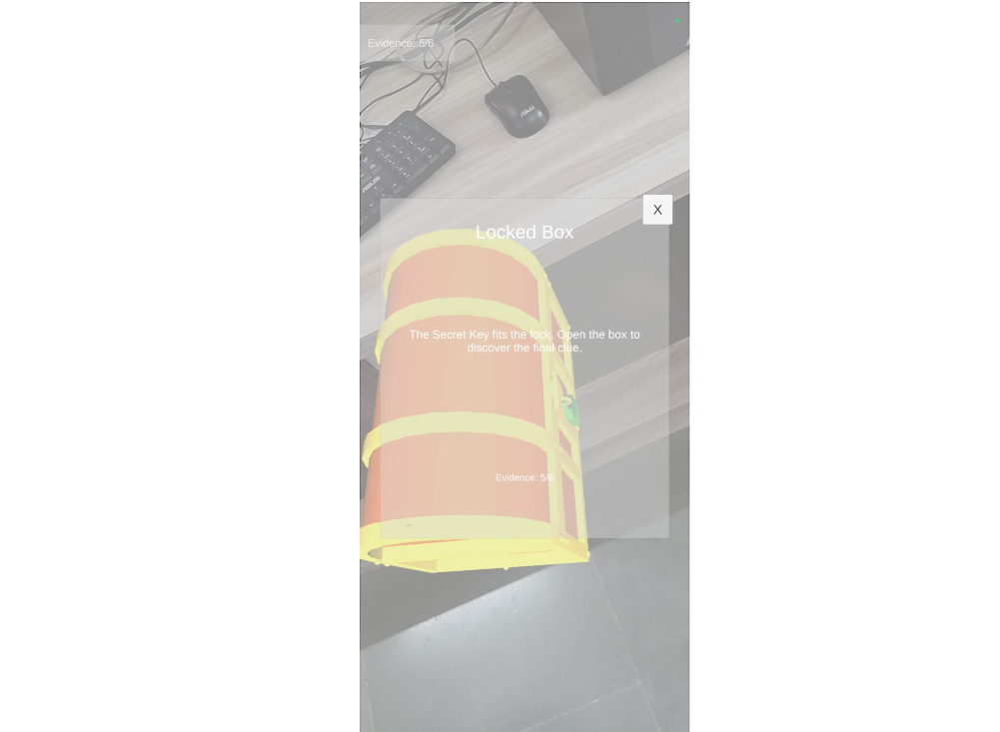
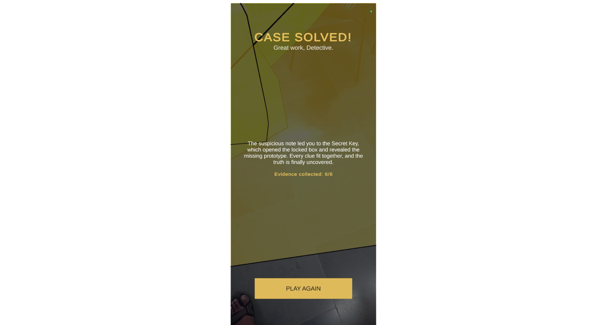

# 🕵️ AR Detective

A mobile **augmented reality detective game** built in Unity. Scan your real surroundings, place virtual evidence on walls and tables, tap objects to read clues, and solve the case.

> College project — B.E. Information Technology, St. Francis Institute of Technology (SFIT), Mumbai.

---

## 📲 Download & Try the App (Android)

You don't need Unity to play. Just install the APK on your phone.

1. Open the **[`Releases`](Releases/)** folder in this repository.
2. Download **[`AR-Detective.apk`](Releases/AR-Detective.apk)** (click the file, then the **Download** / **⬇** button).
3. Copy it to your Android phone (or download it directly on the phone).
4. Tap the APK to install. If asked, allow **"Install from unknown sources"** for your browser or file manager.
5. Open **AR Detective** and allow **Camera** permission.

**Requirements**
- An Android phone that supports **[ARCore](https://developers.google.com/ar/devices)**
- Google Play Services for AR (the phone may prompt you to install/update it)
- A well-lit room with visible surface detail (plain white walls or glossy floors are hard to track)

---

## 🎮 How to Play

1. Tap **Open Case File** on the welcome screen.
2. Move your phone slowly to scan the room until surfaces are detected.
3. Point at a **wall** and tap to place the **Detective Board**.
4. Tap the placed object to read its clue, then close the popup to move on.
5. Place the next objects on **floors or tables** and keep tapping to collect evidence.
6. Finish all 6 clues to reach the **Case Solved** screen. Tap **Play Again** to restart.

**Case sequence:** Detective Board → Open Box → Suspicious Note → Secret Key → Locked Box → Final Clue

The in-game assistant gives hints if you get stuck.

---

## ✨ Features

- Markerless AR with **plane detection** (vertical wall + horizontal surfaces)
- Tap-to-place objects using **AR raycasting**
- Touch interaction with 3D objects using colliders
- Staged investigation with clue popups
- Hint system and **evidence counter (0/6 → 6/6)**
- Welcome screen, Case Solved screen and restart flow

---

## 🛠️ Tech Stack

| Component | Technology |
|---|---|
| Engine | Unity 6.1.14f1 |
| Language | C# |
| AR framework | AR Foundation 6.6.2 |
| AR provider | ARCore XR Plugin 6.6.2 |
| Input | Unity Input System 1.14.0 |
| 3D model import | glTFast 6.20.0 (GLB/glTF) + FBX |
| Rendering | Universal Render Pipeline (URP) 17.1.0 |
| UI | Unity UI (UGUI) + TextMeshPro |
| Platform | Android (ARCore) |

---

## 📁 Repository Structure

```text
AR-Detective
│
├── Source Code
│   ├── Assets/            # Scenes, scripts, models, UI
│   ├── Packages/          # Package manifest (AR Foundation, ARCore, etc.)
│   └── ProjectSettings/   # Unity project settings
│
└── Releases
    └── AR-Detective.apk   # Ready-to-install Android build
```

### Main scripts

| Script | Purpose |
|---|---|
| `ARTapPlacementManager.cs` | Raycasts to detected planes, places objects, detects object taps |
| `InvestigationManager.cs` | Controls the investigation stages and clue sequence |
| `UIManager.cs` | Welcome screen, clue popups, hints, evidence counter, Case Solved screen |
| `ARFaceCamera.cs` | Rotates objects to face the camera |
| `InvestigationObject.cs` | Forwards object taps to the investigation manager |

The main scene is `Assets/Scenes/SampleScene.unity`.

---

## 💻 Open the Project in Unity (for developers)

1. Install **Unity Hub** and **Unity 6.1.14f1** with the **Android Build Support** module.
2. Clone this repository:
   ```bash
   git clone https://github.com/BinaryBladeImmortal/AR-Detective.git
   ```
3. In Unity Hub, click **Add → Add project from disk** and select the **`Source Code`** folder.
4. Open `Assets/Scenes/SampleScene.unity`.
5. Go to **File → Build Settings**, select **Android**, and click **Switch Platform**.
6. Connect an ARCore-supported phone with **USB debugging** enabled, then click **Build And Run**.

> AR features do not work in the Unity editor's Play mode. Test on a real device.

---

## ⚠️ Known Limitations

- Tracking quality depends on lighting, glare and surface texture.
- Objects are placed from raycast poses without explicit AR anchors, so placement is valid for the current AR session only and may drift if tracking is interrupted.
- Works only on ARCore-supported Android devices.

---

## 🚀 Future Scope

- AR anchors for more stable placement
- Voice guidance / narrated clues
- More cases, branching clues and difficulty levels
- Better lighting integration for virtual objects
- Wider device testing

---

## 📸 Screenshots
(this is a mobile application therefore imgs are in portrait 16:9)

| Welcome | Board Placement | Clue Popup | Case Solved |
|---|---|---|---|
|  |  |  |  |

---

## 🙏 Credits & Assets

- Built with [Unity](https://unity.com/), [AR Foundation](https://docs.unity3d.com/Packages/com.unity.xr.arfoundation@6.6/manual/index.html) and [Google ARCore](https://developers.google.com/ar).
- 3D models: _add creator, source link and license for each imported model here._

---

## 👤 Author

**Jolls Dmello** — B.E. Information Technology, SFIT Mumbai

---

## 📄 License

Released under the MIT License. Copyright (c) 2026 Jolls Dmello.
